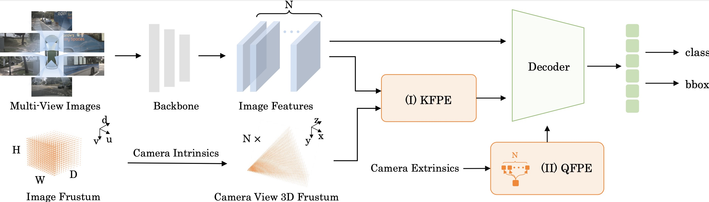

# CAPE: Camera View Position Embedding for Multi-View 3D Object Detection (CVPR2023)
This repository is an official implementation of [CAPE](https://arxiv.org/pdf/2303.10209.pdf) 

<div align="center">
  
</div><br/>

CAPE is a simple yet effective method for multi-view 3D object detection.
CAPE forms the 3D position embedding under the local camera-view system rather than the global coordinate system, which largely reduces the difficulty of the view transformation learning. 
And CAPE supports temporal modeling by exploiting the fusion between separated queries for multi frames.


## Preparation
This implementation is built upon [PETR](https://github.com/megvii-research/PETR), and can be constructed as the [install.md](./install.md).

* Environments  
  Linux, Python==3.7.9, CUDA == 11.2, pytorch == 1.9.1, mmdet3d == 0.17.1   

* Detection Data   
Follow the mmdet3d to process the nuScenes dataset (https://github.com/open-mmlab/mmdetection3d/blob/master/docs/en/data_preparation.md).

* Pretrained weights   
To verify the performance on the val set, we provide the pretrained V2-99 [weights](https://drive.google.com/file/d/1ABI5BoQCkCkP4B0pO5KBJ3Ni0tei0gZi/view?usp=sharing). The V2-99 is pretrained on DDAD15M ([weights](https://tri-ml-public.s3.amazonaws.com/github/dd3d/pretrained/depth_pretrained_v99-3jlw0p36-20210423_010520-model_final-remapped.pth)) and further trained on nuScenes **train set** with FCOS3D.  For the results on test set in the paper, we use the DD3D pretrained [weights](https://drive.google.com/drive/folders/1h5bDg7Oh9hKvkFL-dRhu5-ahrEp2lRNN). The ImageNet pretrained weights of other backbone can be found [here](https://github.com/open-mmlab/mmcv/blob/master/mmcv/model_zoo/open_mmlab.json).
Please put the pretrained weights into ./ckpts/. 

* After preparation, you will be able to see the following directory structure:  
  ```
  CAPE
  ├── mmdetection3d
  ├── projects
  │   ├── configs
  │   ├── mmdet3d_plugin
  ├── tools
  ├── data
  │   ├── nuscenes
  │     ├── samples
  │     ├── ...
  ├── ckpts
  ├── README.md
  ```

## Train & inference
```bash
cd CAPE
```
You can train the model following:
```bash
sh train.sh
```
You can evaluate the model following:
```bash
sh test.sh
```

## Main Results
| config                                                | mAP       | NDS      | config  | download  |
|:-----------------------------------------------------:|:---------:|:--------:|:-------:|:---------:|
| cape_r50_1408x512_24ep_wocbgs_imagenet_pretrain       | 34.7%     | 40.6%    |[config](projects/configs/CAPE/cape_r50_1408x512_24ep_wocbgs_imagenet_pretrain.py) | [log](https://drive.google.com/file/d/1FuaByEOMShcntgbRoZv4hJOffIEiUYer/view?usp=share_link) / [checkpoint](https://drive.google.com/file/d/1_4WZzYYHVUso0C6XDJ4m2fg-ZWSRxcBQ/view?usp=share_link)
| capet_r50_704x256_24ep_wocbgs_imagenet_pretrain       | 31.8%     | 44.2%    |[config](projects/configs/CAPE-T/capet_r50_704x256_24ep_wocbgs_imagenet_pretrain.py) | [log](https://drive.google.com/file/d/1iZnnvfp2y4g6azW2PV-4ggIpqiz2jTcv/view?usp=share_link) / [checkpoint](https://drive.google.com/file/d/163MRL60YTPIv7cUcioNsWCMWTBUhjKnA/view?usp=share_link)
| capet_VoV99_800x320_24ep_wocbgs_load_dd3d_pretrain    | 44.0%     | 53.6%    | [config](projects/configs/CAPE-T/capet_VoV99_800x320_24ep_wocbgs_load_dd3d_pretrain.py) | [log](https://drive.google.com/file/d/1c3rY08idaDPE-0pjZQIHyT8aS2G24zAy/view?usp=share_link) / [checkpoint](https://drive.google.com/file/d/1z_GaLVfrNu9PJkyAnyJJUvHCEwBgqt3P/view?usp=share_link)

## Acknowledgement
Many thanks to the authors of [mmdetection3d](https://github.com/open-mmlab/mmdetection3d).
Special thanks to the authors of [PETR](https://github.com/megvii-research/PETR).

## Citation
If you find this project useful for your research, please consider citing: 
```
@article{Xiong2023CAPE,
  title={CAPE: Camera View Position Embedding for Multi-View 3D Object Detection},
  author={Kaixin Xiong, Shi Gong, Xiaoqing Ye, Xiao Tan, Ji Wan, Errui Ding, Jingdong Wang, Xiang Bai},
  booktitle={Computer Vision and Pattern Recognition},
  year={2023}
}
```

## Contact
If you have any questions, feel free to open an issue or contact us at kaixinxiong@hust.edu.cn or gongshi@baidu.com or yexiaoqing@baidu.com.
